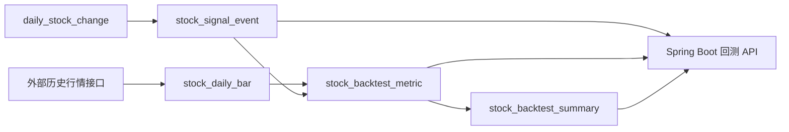

# 增持事件回测与评分系统设计

## 1. 目标

在现有“增减持监控”系统基础上，新增一套离线回测与评分体系，用于回答两个问题：

- 哪些增持事件，在未来 5 / 10 / 20 / 60 个交易日内更容易带来正收益？
- 哪些股票对增持信号的历史响应更稳定，适合优先跟踪？

系统采用以下原则：

- 外部历史行情接口只作为数据输入源
- 本地数据库作为回测、评分、展示的唯一主数据源
- 工作日每日增量刷新
- 每周一次全量校准
- 查询端只读本地结果，不依赖外部接口实时返回

## 2. 现状与约束

- `daily_stock_change` 已有长期历史，但 `stock_price_tracking` 仅覆盖近几个月，无法支撑长周期回测
- 当前外部链路主要用于单股历史详情弹窗，不适合高频、大批量、可重复的回测查询
- 源数据只有 `trade_date`，暂无明确“公告披露日 / 市场可见日”，第一阶段更准确地说是“事件研究”，不是严格可交易策略回测

## 3. 核心方案

### 3.1 数据来源

- 事件源：`daily_stock_change`
- 历史行情源：AKShare / 东方财富历史日线接口
- 展示源：本地回测结果表

### 3.2 刷新策略

#### 每日增量刷新

- 先跑 `daily_stock_change` 导入
- 找出最近有更新的股票
- 为这些股票增量拉取历史日线
- 重建这些股票的事件、回测指标和股票汇总
- 历史日线同步允许受控并发抓取，默认通过环境变量控制并发度

#### 每周全量校准

- 全量拉取全部事件股票的历史日线
- 全量重建事件表
- 全量重算回测结果和股票画像
- 全量重算按股票分批处理，避免一次性载入全部行情导致内存抖动

## 4. 事件定义

第一阶段采用“日级事件”作为标准样本：

- 样本主键：`stock_code + signal_date + event_scope`
- `signal_date`：该股票发生增持的交易日
- `event_scope`：第一阶段固定为 `day`

事件聚合规则：

- 同一股票同一天多人增持：合并为一个事件
- 同一日同时存在增持和减持：保留事件，并增加惩罚标记
- 连续多日增持：不合并样本，但记录 `consecutive_increase_days`

后续第二阶段可增加 `wave` 事件，把连续增持波段聚合成一条样本。

## 5. 数据表设计

### 5.1 `stock_daily_bar`

保存外部历史接口同步到本地后的标准化日线。

关键字段：

- `stock_code`
- `trade_date`
- `open_price`
- `close_price`
- `high_price`
- `low_price`
- `volume`
- `amount`
- `change_rate`
- `adjust_type`
- `data_source`

### 5.2 `stock_signal_event`

保存日级增持事件聚合结果。

关键字段：

- `event_id`
- `stock_code`
- `stock_name`
- `signal_date`
- `event_scope`
- `increase_count`
- `increase_amount`
- `increase_ratio_sum`
- `increase_ratio_max`
- `changer_count`
- `changer_names`
- `position_tags`
- `has_same_day_decrease`
- `same_day_decrease_amount`
- `consecutive_increase_days`
- `signal_score`
- `event_version`

### 5.3 `stock_backtest_metric`

保存单事件在不同观察窗口下的回测指标。

关键字段：

- `event_id`
- `horizon_days`
- `entry_date`
- `entry_price`
- `entry_price_type`
- `exit_date`
- `exit_price`
- `return_pct`
- `max_return_pct`
- `max_drawdown_pct`
- `volatility_pct`
- `hit_3pct_flag`
- `hit_5pct_flag`
- `hit_10pct_flag`
- `is_positive_flag`
- `bars_count`
- `calc_version`

### 5.4 `stock_backtest_summary`

保存股票级长期表现画像。

关键字段：

- `stock_code`
- `stock_name`
- `sample_event_count`
- `win_rate_5d`
- `win_rate_10d`
- `win_rate_20d`
- `avg_return_5d`
- `avg_return_10d`
- `avg_return_20d`
- `median_return_20d`
- `avg_max_drawdown_20d`
- `hit_5pct_rate_20d`
- `hit_10pct_rate_60d`
- `historical_response_score`
- `backtest_score`
- `last_event_date`

### 5.5 `backtest_job_log`

保存每日 / 每周任务运行日志。

## 6. 回测计算口径

第一阶段固定如下：

- 信号日：`signal_date`
- 入场日：`signal_date` 后第 1 个交易日
- 入场价：次日开盘价
- 退出价：第 N 个交易日收盘价
- 观察窗口：`5 / 10 / 20 / 60`
- 价格源：`stock_daily_bar`

### 6.1 指标公式

- `return_pct = (exit_price - entry_price) / entry_price`
- `max_return_pct = 窗口内最高价相对 entry_price 的最大涨幅`
- `max_drawdown_pct = 窗口内最低价相对 entry_price 的最大回撤`
- `is_positive_flag = return_pct > 0`
- `hit_3pct_flag = max_return_pct >= 0.03`
- `hit_5pct_flag = max_return_pct >= 0.05`
- `hit_10pct_flag = max_return_pct >= 0.10`

## 7. 评分设计

### 7.1 `signalScore`

用于描述事件当下的信号强弱，不使用未来数据。

建议权重：

- 增持金额强度：25
- 增持比例强度：20
- 多人协同增持：15
- 身份权重：15
- 连续增持天数：15
- 同日减持惩罚：10

### 7.2 `backtestScore`

用于描述该股票历史上对增持信号的兑现能力。

建议权重：

- 20 日胜率：25
- 20 日平均收益：20
- 20 日中位收益：15
- 20 日最大回撤控制：15
- 60 日命中 10% 概率：15
- 样本稳定性：10

## 8. 任务拆分

### 8.1 `stock_daily_bar_sync.py`

负责同步历史日线到 `stock_daily_bar`。

支持两种模式：

- `incremental`
- `full`

关键环境变量：

- `BACKTEST_DAILY_BAR_MAX_WORKERS`
- `BACKTEST_BAR_SYNC_OVERLAP_DAYS`
- `BACKTEST_DAILY_BAR_ADJUST`

### 8.2 `stock_backtest_builder.py`

负责构建：

- `stock_signal_event`
- `stock_backtest_metric`
- `stock_backtest_summary`

关键环境变量：

- `BACKTEST_BUILD_BATCH_STOCKS`
- `BACKTEST_HORIZONS`
- `BACKTEST_EVENT_VERSION`
- `BACKTEST_CALC_VERSION`

### 8.3 `backtest_pipeline.py`

编排整条任务链：

- 初始化 schema
- 同步日线
- 构建事件
- 计算回测指标
- 记录任务日志

## 9. 后端接口设计

第一阶段新增：

- `GET /api/backtest/overview`
- `GET /api/backtest/events`
- `GET /api/backtest/stocks/{code}/summary`

后续再增加：

- `GET /api/backtest/events/{eventId}`
- `POST /api/backtest/rebuild`

## 10. 前端落地建议

当前阶段先完成后端与离线任务，前端第二阶段新增“回测分析”模块：

- 回测总览页
- 事件列表页
- 股票画像页

## 11. 风险与边界

- 没有公告披露日时，不应宣称为严格可交易策略回测
- 外部接口字段或复权口径可能变化，因此必须保留每周全量校准
- 同股同日多人增持必须聚合，避免重复样本
- 同日增持与减持混合时不能简单丢弃，必须保留惩罚信息
